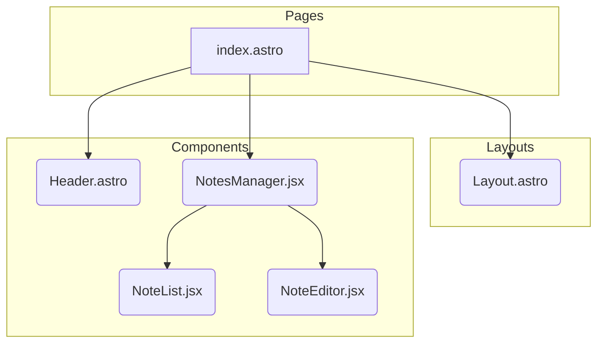

# Architecture Overview for NotesApp

## 1. Introduction

This document provides a technical overview of the NotesApp frontend application, including its architecture, technology stack, and component structure.

## 2. Technical Stack

- **Framework:** [Astro](https://astro.build/) - A modern static site builder that allows for shipping less JavaScript by default.
- **UI Components:** [Preact](https://preactjs.com/) - A fast 3kB alternative to React with the same modern API.
- **Styling:** [Tailwind CSS](https://tailwindcss.com/) - A utility-first CSS framework for rapid UI development.
- **State Management:** Local State (Preact `useState` and `useEffect`) - For the initial version, the application state is managed within the `NotesManager` component.
- **Storage:** [localStorage](https://developer.mozilla.org/en-US/docs/Web/API/Window/localStorage) - Notes are persisted in the browser's local storage.

## 3. Frontend Architecture

The application follows a component-based architecture.



- **`index.astro`**: The main entry point of the application. It assembles the different components (`Header`, `NotesManager`) within the `Layout`.
- **`Layout.astro`**: The main layout component that defines the basic HTML structure, including the head, body, and global styles.
- **`Header.astro`**: The top navigation bar of the application, which includes the app title and the "New Note" button.
- **`NotesManager.jsx`**: The core component that manages the application's state and logic. It fetches, creates, updates, and deletes notes.
- **`NoteList.jsx`**: A component that displays a list of notes and allows the user to select a note to view or edit.
- **`NoteEditor.jsx`**: A component that provides a form for editing the title and content of a note.

## 4. State Management and Data Flow

- The `NotesManager.jsx` component is the single source of truth for the application's state.
- It uses Preact's `useState` hook to manage the list of notes (`notes`) and the currently active note (`activeNoteId`).
- The `useEffect` hook is used to load notes from `localStorage` when the component mounts.
- Data is passed down from `NotesManager` to child components (`NoteList`, `NoteEditor`) via props.
- Child components communicate with the `NotesManager` by calling functions passed down as props (e.g., `onSelectNote`, `onSave`, `onDelete`).

## 5. Extensibility: Connecting to a Backend

The current implementation uses `localStorage` for data persistence. To connect to a backend, the following changes would be needed:

- **API Layer:** Create a new module (e.g., `src/api.js`) that encapsulates all API calls to the backend. This module would have functions like `getNotes`, `saveNote`, and `deleteNote` that make `fetch` requests to the backend API.
- **Update `NotesManager.jsx`:** Replace the mock API functions (`getNotes`, `saveNote`, `deleteNote` that use `localStorage`) with the new API layer functions. This would involve making asynchronous API calls and updating the component's state with the data received from the backend.

## 6. Directory and Component Structure

The project follows a standard Astro project structure:

```
notes_frontend/
├── public/
├── src/
│   ├── assets/
│   ├── components/
│   │   ├── Header.astro
│   │   ├── NoteEditor.jsx
│   │   ├── NoteList.jsx
│   │   └── NotesManager.jsx
│   ├── layouts/
│   │   └── Layout.astro
│   └── pages/
│       └── index.astro
├── astro.config.mjs
├── package.json
└── tailwind.config.cjs
```

- **`src/components/`**: Contains reusable UI components.
- **`src/layouts/`**: Contains layout components that define the structure of pages.
- **`src/pages/`**: Contains the pages of the application. Each file in this directory becomes a route.
- **`public/`**: Contains static assets like images and fonts.
